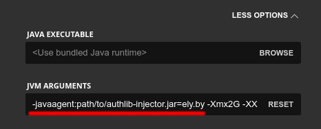

Authlib-injector
----------------

**authlib-injector** is a library that allows you to spoof authorization and session server addresses in the Authlib, without modifying the library itself. It's designed as an javaagent.

This library significantly simplifies the installation of an alternative authorization service in the game client and server, since transformation occurs during application bootstrap process.

You can download the latest version from the `releases page on GitHub <https://github.com/yushijinhun/authlib-injector/releases/latest>`_.

Here is the documentation of the key aspects of installing and using the library. For more information, see the `original documentation in Chinese <https://github.com/yushijinhun/authlib-injector/wiki>`_.

.. _client:

Installing in a game client
===========================

.. attention:: This section describes how to install the authlib-injector into the game. The game launcher still needs to implement the authorization flow itself in order to pass the ``accessToken`` to the game.

To install the library, you need to specify it as a javaagent for the game. You can do this by prepending the line ``-javaagent:/path/to/file/authlib-injector.jar=ely.by`` as a game launching param. As the result, the launch command should look like this:

.. code-block::

   java -javaagent:/path/to/file/authlib-injector.jar=ely.by -jar minecraft.jar

If you run the game through a launcher, then in its settings you need to find a field for specifying additional JVM arguments, in which you need to insert the line above at the beginning.

.. _server:

Installing on a server
======================

Just as in the case with the game client, the library must be specified as javaagent. `Download the library <https://github.com/yushijinhun/authlib-injector/releases/latest>`_ and put in the server's directory. Then add the javaagent call to the server launch command:

| Before: ``java -jar minecraft_server.jar``
| After: ``java -javaagent:authlib-injector.jar=ely.by -jar minecraft_server.jar``

During server startup you should see a message about the activation of the authlib-injector:

.. figure:: ../_static/authlib-injector/server-startup-messages.png
   :align: center
   :alt: Message at server startup

BungeeCord
~~~~~~~~~~

The authlib-injector must be installed directly on the BungeeCord itself, as well as **on all backends** behind it. Note the configuration of the online-mode parameter:

* The BungeeCord's configuration (``config.yml``) should contain ``online_mode=true``;
* The servers behind the proxy must contain in their configuration (``server.properties``) the value ``online-mode=false``.

Using such configuration authorization will work for all logging in players and the internal servers will correctly display player skins.

LaunchHelper
~~~~~~~~~~~~

Not all game hostings allow direct modifications of launch arguments. To get around this limitation, you can use a special server that runs the game server by mixing authlib-injector into it. To install, follow these instructions:

#. Download the corresponding LaunchHelper for your operating system from the `releases page <https://github.com/Codex-in-somnio/LaunchHelper/releases/latest>`_.

#. Upload this file and the ``authlib-injector.jar`` file to the server folder on your hosting site.

#. Also create a ``launchhelper.properties`` file and put the following contents into it:

   .. code-block::

      javaAgentJarPath=authlib-injector.jar
      javaAgentOptions=ely.by
      execJarPath=minecraft_server.jar

   Where ``javaAgentJarPath`` contains the path to the authlib-injector.jar file and ``execJarPath`` contains the name of the server file.

#. In the hosting control panel, specify the ``LaunchHelper.jar`` as the server file.

   If you can't change the executable file, you should rename the ``LaunchHelper.jar`` file to match your hosting requirements (usually, ``server.jar``). In this case, you should have the following file structure:

   * ``server.jar`` - the LaunchHelper file.
   * ``minecraft_server.jar`` - your server core.
   * ``authlib-injector.jar`` - the authlib-injector file.
   * ``launchhelper.properties`` - the configuration file for the LaunchHelper.
