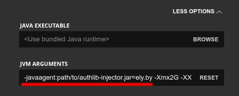
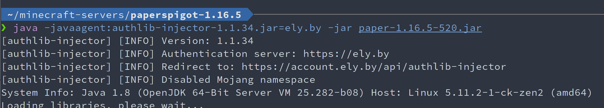

Authlib-injector
----------------

**authlib-injector** — это библиотека, позволяющая подменить адреса серверов авторизации и сессии в Authlib, не модифицируя непосредственно саму библиотеку. Выполнена как javaagent.

Данная библиотека значительно упрощает установку альтернативных сервисов авторизации в игровой клиент и сервер, поскольку она универсально применяет трансформацию в процессе работы программы.

Скачать последнюю версию можно со `страницы релизов на GitHub <https://github.com/yushijinhun/authlib-injector/releases/latest>`_.

Здесь приведена документация к ключевым аспектам установки и использования библиотеки. Для более подробной информации обратитесь к `оригинальной документации на китайском языке <https://github.com/yushijinhun/authlib-injector/wiki>`_.

.. _client:

Установка в игровой клиент
==========================

.. attention:: Обратите внимание, что этот раздел описывает установку authlib-injector в игру. Игровой лаунчер по-прежнему должен самостоятельно реализовать процесс авторизации, чтобы после передать ``accessToken`` в игру.

Для применения библиотеки, необходимо указать её в качестве javaagent для игры. Сделать это можно, добавив в начало команды запуска игры строку ``-javaagent:/путь/до/файла/authlib-injector.jar=ely.by``. В результате изменений строка запуска игры должна выглядеть следующим образом:

.. code-block::

   java -javaagent:/путь/до/файла/authlib-injector.jar=ely.by -jar minecraft.jar

Если вы запускаете игру через лаунчер, то в его настройках необходимо найти поле для указания дополнительных аргументов JVM, куда необходимо в самое начало вставить строку, приведённую выше.

.. _server:

Установка на сервер
===================

Также как и в случае с игровым клиентом, библиотеку необходимо указать в качестве javaagent. `Скачайте библиотеку <https://github.com/yushijinhun/authlib-injector/releases/latest>`_ и поместите её в директорию с сервером. После этого добавьте вызов javaagent в команду запуска сервера:

| До: ``java -jar minecraft_server.jar``
| После: ``java -javaagent:authlib-injector.jar=ely.by -jar minecraft_server.jar``

При запуске сервера вы должны увидеть сообщение об активации authlib-injector:

BungeeCord
~~~~~~~~~~

authlib-injector должен быть установлен непосредственно на сам BungeeCord, а также **на все сервера** позади него. Обратите внимание на конфигурацию параметра online‑mode:

* В конфигурации BungeeCord (``config.yml``) должно стоять значение ``online_mode=true``.
* В конфигурации всех серверов позади прокси (``server.properties``) должно быть указано значение ``online-mode=false``.

Благодаря такой конфигурации установки, авторизация будет работать для всех входящих игроков, а на внутренних серверах будут корректно отображаться скины игроков.

LaunchHelper
~~~~~~~~~~~~

Не все игровые хостинги позволяют напрямую модифицировать аргументы, с которыми запускается сервер. Чтобы обойти это ограничение, можно использовать специальный сервер, который запускает игровой сервер, подмешивая туда authlib-injector. Для установки следуйте инструкции:

#. Скачайте версию LaunchHelper для вашей операционной системы со `страницы загрузок <https://github.com/Codex-in-somnio/LaunchHelper/releases/latest>`_.

#. Загрузите скачанный файл и файл ``authlib-injector.jar`` в папку сервера на вашем хостинге.

#. Там же создайте файл ``launchhelper.properties`` и поместите в него следующее содержимое:

   .. code-block::

      javaAgentJarPath=authlib-injector.jar
      javaAgentOptions=ely.by
      execJarPath=minecraft_server.jar

   Где ``javaAgentJarPath`` содержит путь до файла authlib-injector.jar, а ``execJarPath`` содержит имя файла сервера.

#. В панели управления хостингом укажите ``LaunchHelper.jar`` в качестве запускаемого файла сервера.

   Если возможности указать исполнимый файл явно нет, то следует переименовать файл ``LaunchHelper.jar`` в соответствие с требованиями вашего хостинга (обычно, это ``server.jar``). В этом случае у вас должна получиться следующая структура файлов:

   * ``server.jar`` - файл LaunchHelper.
   * ``minecraft_server.jar`` - предпочитаемое ядро сервера.
   * ``authlib-injector.jar`` - файл authlib-injector.
   * ``launchhelper.properties`` - файл конфигурации для LaunchHelper.
