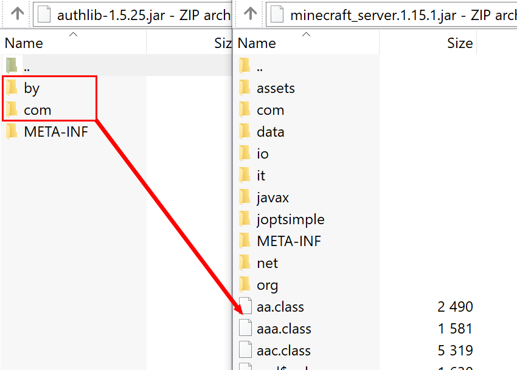

Авторизация для Minecraft
-------------------------

Здесь приведена информация по авторизации для лаунчеров и серверов Minecraft через сервис авторизации Ely.by.

Протокол авторизации реализован максимально похожим на `оригинальный протокол авторизации Mojang <http://wiki.vg/Authentication>`_,
но тем не менее эта документация описывает все доступные функции конкретно сервиса авторизации Ely.by.

Общие положения
===============

* Все запросы должны выполняться на URL **https://authserver.ely.by**.

* При успешном запросе, сервер вернёт ответ со статусом 200. Любой другой код свидетельствует об ошибке.

* Сервер всегда отвечает JSON данными, кроме случаев системных ошибок и ответов на legacy запросы. Учитывайте это для
  отображения пользователю правильного сообщения об ошибке.

* В случае стандартной ошибки, вы получилите следующие данные:

  .. code-block:: javascript

     {
         "error": "Краткое описание ошибки",
         "errorMessage": "Более длинное описание ошибки на английском языке, пригодное для отображения пользователю."
     }

Предусмотренные ошибки
~~~~~~~~~~~~~~~~~~~~~~

В отличие от оригинального протокола, на Ely применяется меньший зоопарк ошибок:

.. list-table::
   :widths: 20 50 30
   :header-rows: 1

   * - Ошибка (error)
     - Причина
     - Решение
   * - IllegalArgumentException
     - Вы передали неполный список данных для выполнения запроса.
     - Внимательно перепроверьте что вы шлёте в запросе и что указано в документации.
   * - ForbiddenOperationException
     - Пользователь ввёл/разработчик передал неверные значения.
     - Необходимо вывести пользователю уведомление о неправильно введённых данных.

Для индикации ошибки Not Found используется ответ с 404 статусом.

Авторизация в лаунчере
======================

В этом разделе описана авторизация для лаунчера или любой другой настольной программы, которой необходимо получить
accessToken для игрового клиента Minecraft. Важно понимать, что этот accessToken не имеет ничего общего с accessToken,
получаемым при oAuth авторизации - это два абсолютно разных ключа.

Все запросы выполняются на подуровень /auth POST запросом.

.. function:: /auth/authenticate

   Непосредственная авторизация пользователя, используя его логин (ник или e-mail) и пароль.

   :param string username: Никнейм пользователя или его e-mail (более предпочтительно).
   :param string password: Пароль пользователя.
   :param string clientToken: Уникальный токен лаунчера пользователя.

   Успешный ответ:

   .. code-block:: javascript

      {
          'accessToken': "Длинная_строка_содержащая_access_token",
          'clientToken': "Переданный_в_запросе_client_token",
          'availableProfiles': {}, /* См. ниже */
          'selectedProfile': {
              'id': "Длинная_строка_с_uuid_пользователя",
              'name': "Текущий_nickname_пользователя",
              'legacy': false
          }
      }

   **availableProfiles** содержит в себе массив с одним элементом, таким же, как и selectedProfile. Добавлено только для
   соответствия оригинальному протоколу и на деле не используется самими Mojang.

   Касательно параметра **legacy** в selectedProfile в оригинальном протоколе явно не даны пояснения на счёт этого
   параметра, но сказано, что обычно он в false. Возможно, он как-то используется официальным лаунчером.

.. function:: /auth/refresh

   Обновляет валидный accessToken. Этот запрос позволяет не хранить на клиенте его пароль, а оперировать только сохранённым
   значением accessToken для практически бесконечной возможности проходить авторизацию.

   :param string accessToken: Уникальный ключ, полученый после авторизации.
   :param string clientToken: Уникальный идентификатор клиента, относительно которого получен accessToken.

   .. note:: В оригинальном протоколе так же передаётся значение selectedProfile, но на деле от него мало что зависит и
             для идентификации пользователя достаточно только этих двух параметров. Наш сервер не обидится, увидив его -
             он просто его проигнорирует.

   В случае получения какой-либо предусмотренной ошибки, следует заново запросить пароль пользователя и произвести
   обычную авторизацию.

   Успешный ответ:

   .. code-block:: javascript

      {
          'accessToken': "Новая_длинная_строка_ содержащая_access_token",
          'clientToken': "Переданный_в_запросе_client_token",
          'selectedProfile': {
              'id': "Длинная_строка_с_uuid_пользователя",
              'name': "Текущий_nickname_пользователя",
              'legacy': false
          }
      }

.. function:: /auth/validate

   Этот запрос позволяет проверить валиден ли указанный accessToken или нет. Этот запрос не обновляет токен и его время
   жизни, а только позволяет удостовериться, что он ещё действительный.

   :param string accessToken: Уникальный ключ, полученый после авторизации.

   Успешным ответом будет являться пустое тело. При ошибке будет получен **400** или **401** статус. Пример ответа сервера
   при отправке истёкшего токена:

   .. code-block:: javascript

     {
         "error: "ForbiddenOperationException",
         "errorMessage": "Token expired."
     }

.. function:: /auth/signout

   Этот запрос позволяет выполнить инвалидацию всех выданных пользователю токенов.

   :param string username: Никнейм пользователя или его e-mail (более предпочтительно).
   :param string password: Пароль пользователя.

   Успешным ответом будет являться пустое тело. Ориентируйтесь на поле **error** в теле ответа.

.. function:: /auth/invalidate

   Запрос позволяет инвалидировать accessToken. В случае, если переданный токен не удастся найти в хранилище токенов,
   ошибка не будет сгенерирована и вы получите успешный ответ.

   Входные параметры:

   :param string accessToken: Уникальный ключ, полученый после авторизации.
   :param string clientToken: Уникальный идентификатор клиента, относительно которого получен accessToken.

   Успешным ответом будет являться пустое тело. Ориентируйтесь на поле **error** в теле ответа.

Авторизация на сервере
======================

Эти запросы выполняются непосредственно клиентом и сервером при помощи внутреннего кода или библиотеки authlib
(начиная с версии 1.7.2). Они актуальны только в том случае, если вы уже произвели авторизацию и запустили игру с валидным
accessToken. Вам остаётся только заменить пути внутри игры/библиотеки на привидённые ниже пути.

Поскольку непосредственно изменить что-либо в работе authlib или игры вы не можете, здесь не приводятся передаваемые значения
и ответы сервера. При необходимости вы сможете найти эту информацию самостоятельно в интернете.

Через authlib
~~~~~~~~~~~~~

.. important:: Эта часть документации описывает запросы, выполняемые через authlib в версии игры 1.7.2+. Для более старых
               версий смотрите раздел ниже.

Все запросы из этой категории выполняются на подуровень /session. Перед каждым из запросов указан тип отправляемого запроса.

.. function:: POST /session/join

   Запрос на этот URL производится клиентом в момент подключения к серверу с online-mode=true.

.. function:: GET /session/hasJoined

   Запрос на этот URL выполняет сервер с online-mode=true после того, как клиент, пытающийся к нему подключится, успешно
   выполнит join запрос.

   .. attention:: Внутри тела ответа есть параметр **properties**, который, в свою очередь, содержит поле **value** с
                  закодированной в ней base64 строкой. В оригинальной системе авторизации данные зашифрованы с помощью
                  приватного ключа и расшифровывались на клиенте с помощью публичного.

                  Ely, в свою очередь, **не выполняет шифрацию вовсе**, поэтому вам необходимо отключить проверку подписи в
                  библиотеке authlib. В противном случае текстуры всегда будут признаваться невалидными.

Для старых версий
~~~~~~~~~~~~~~~~~

.. important:: Эта часть документации описывает запросы, выполняемые более старыми версиями Minecraft, когда не применялась
               библиотека authlib. Это все версии, младше версии 1.7.2.

Все запросы из этой категории выполняются на подуровень /session/legacy. Перед каждым из запросов указан тип отправляемого запроса.

Принцип обработки этих запросов такой же, как и для authlib, отличие только во входных параметрах и возвращаемых значения.

.. function:: GET /session/legacy/join

   Запрос на этот URL производится клиентом в момент подключения к серверу с online-mode=true.

.. function:: GET /session/legacy/hasJoined

   Запрос на этот URL выполняет сервер с online-mode=true после того, как клиент, пытающийся к нему подключится, успешно
   выполнит join запрос.

Важно не потерять GET параметр **?user=** в конце обоих запросов, чтобы получились следующие URL:
``http://minecraft.ely.by/session/legacy/hasJoined?user=``.

Одиночная игра
==============

По сути, одиночная игра - это локальный сервер, созданный для одного игрока. По крайней мере это так, начиная с версии 1.6,
в которой и был представлен механизм локальных серверов.

Тем не менее, описанный ниже запрос актуален только для Minecraft 1.7.6+, когда для загрузки скинов стала использоваться
так же authlib.

.. _profile-request:

.. function:: GET /session/profile/{uuid}

   Запрос на этот URL выполняется клиентом в одиночной игре на локальном сервере (созданном посредством самой игры).
   В URL передаётся UUID пользователя, с которым был запущен клиент, а в ответ получается информация о текстурах игрока
   в таком же формате, как и при hasJoined запросе.

Готовые библиотеки authlib
==========================

Поскольку самостоятельная реализация связана с трудностями поиска исходников, подключения зависимостей и в конце-концов
с процессом компиляции, на `странице загрузок нашей системы скинов <//ely.by/load>`_ вы можете загрузить уже
готовые библиотеки со всеми необходимыми изменениями. Выберите в выпадающем списке необходимую версию и следуйте
инструкции по установке, размещённой на той же странице ниже.

В более ранних версиях игры система скинов находилась внутри игрового клиента, так что библиотеки ниже обеспечивают
лишь авторизацию:

* Minecraft 1.7.5 - :download:`authlib 1.3.1 <_static/minecraft-auth/authlib/authlib-1.3.1.jar>`

* Minecraft 1.7.2 - :download:`authlib 1.3 <_static/minecraft-auth/authlib/authlib-1.3.jar>`

Для установки вам необходимо заменить оригинальную библиотеку, располагающуюся по пути
``<директория установки minecraft>/libraries/com/mojang/authlib/``. Убедитесь в том, что версии скачанного и заменяемого
файлов совпадают.

.. _install-server:

Установка authlib на сервер
===========================

Сервер также использует authlib для выполнения авторизации игрока, поэтому соответствующие изменения должны быть
также применены и к нему. Ниже приведены инструкции по установки authlib для различных реализаций сервера Minecraft.

.. note:: Если ни одна из приведённых ниже инструкций не подошла для вашей реализации сервера, пожалуйста,
          создайте `новый issue <https://github.com/elyby/docs/issues/new>`_ и мы допишем инструкцию для вашего сервера.

.. _vanilla:

Оригинальный сервер
~~~~~~~~~~~~~~~~~~~

С помощью архиватора откройте файл сервера ``minecraft_server.ВЕРСИЯ.jar``. Таким же образом откройте архив с
authlib для соответствующей версии сервера. Перед вами будет два окна: одно с файлами сервера, другое с файлами authlib.
Вам необходимо "перетащить" из архива с authlib все файлы и папки, **за исключением директории META-INF**, и подтвердить
замену.

   Обратите внимание: "перетягивать" содержимое нужно ниже папок сервера (в область файлов .class).

После этих действий вы можете закрыть оба окна и в файле ``server.properties`` установить значение ``online-mode=true``.

Bukkit/Spigot
~~~~~~~~~~~~~

Сперва выполните установку, как она описана для `оригинального сервера <#vanilla>`_. Затем скачайте библиотеки
`commons-io <https://repo1.maven.org/maven2/commons-io/commons-io/2.5/commons-io-2.5.jar>`_ и
`commons-lang3 <https://repo1.maven.org/maven2/org/apache/commons/commons-lang3/3.5/commons-lang3-3.5.jar>`_,
после чего аналогичным с authlib образом последовательно переместите содержимое скачанных архивов в файлы сервера.

Forge/Sponge
~~~~~~~~~~~~

Прежде чем производить установку, необходимо определить, какой именно файл подлежит модификации:

* **>=1.16**: ``libraries/net/minecraft/server/ВЕРСИЯ-ЦИФРЫ/server-ВЕРСИЯ-ЦИФРЫ-extra.jar``.
* **1.13-1.15**: ``libraries/net/minecraft/server/ВЕРСИЯ/server-ВЕРСИЯ-extra.jar``.
* **<=1.12**: ``minecraft_server.ВЕРСИЯ.jar``.

Когда необходимый файл найден, выполните для него установку authlib, аналогично `оригинальному серверу <#vanilla>`_.

Paper (PaperSpigot)
~~~~~~~~~~~~~~~~~~~

Установка производится по аналогии с `Bukkit/Spigot <#bukkit-spigot>`_ в файл ``cache/patched-ВЕРСИЯ.jar``.
После внесения изменений, запускать сервер нужно через jar-файл из директории ``cache``, поскольку в противном случае
**Paper восстановит исходное состояние файла**:

| До: ``java -jar paper-ВЕРСИЯ-БИЛД.jar``
| После: ``java -jar cache/patched-ВЕРСИЯ.jar``

Bungeecord
~~~~~~~~~~

Установку необходимо производить только на сервер, на который пользователь выполняет первичных вход. В зависимости от
используемого ядра сервера, обратитесь к одному из пунктов `выше <#install-server>`_.

Установка на версии ниже 1.7.2
==============================

Для более старых версий существует достаточно большое многообразие различных случаев, раскрыть которые в этой документации
не представляется возможным. Вся установка заключается в замене определённых строк в определённых классах через
InClassTranslator.

На форуме RuBukkit есть отличный пост, в котором собрана вся нужна информация по именам классов на различных версиях
Minecraft. Переписывать его сюда не имеет смысла, так что просто перейдите на его страницу и найдите нужную версию.

|rubukkit_link|.

.. |rubukkit_link| raw:: html

   <a href="http://www.rubukkit.org/threads/spisok-klassov-i-klientov-dlja-mcp.25108/#post-303710" target="_blank">RuBukkit -
   Список классов и клиентов для MCP</a>

Пример установки
~~~~~~~~~~~~~~~~

Предположим, что вы хотите установить авторизацию на сервер версии 1.5.2.

Сначала вы переходите по вышепривидённой ссылке, выбираете нужную версию (1.5.2) и видите список классов:

* **bdk.class** - путь до joinserver

* **jg.class** - путь до checkserver

Затем вы должны взять .jar файл клиента и открыть его любым архиватором. После чего вам необходимо найти файл **bdk.class**.
Для этого удобно воспользоваться поиском.

После того, как вы нашли файл, его нужно извлечь из архива - просто перетащите его оттуда в удобную для вас дирикторию.

Дальше запустите InClassTranslator и в нём откройте этот класс. Слева будет список найденных в файле строк, которые вы
можете изменить. Нужно заменить только строку, отвечающую за запрос на подключение к серверу:

После этого вам нужно положить изменённый .class обратно в .jar файл игры.

Ту же самую операцию вам необходимо провести и с сервером, только заменить ссылку на hasJoined.

-----------------------

После этих действий вам нужно в настройках включить online-mode=true и сервер станет пускать на себя только тех игроков,
которые будут авторизованы через Ely.by.
